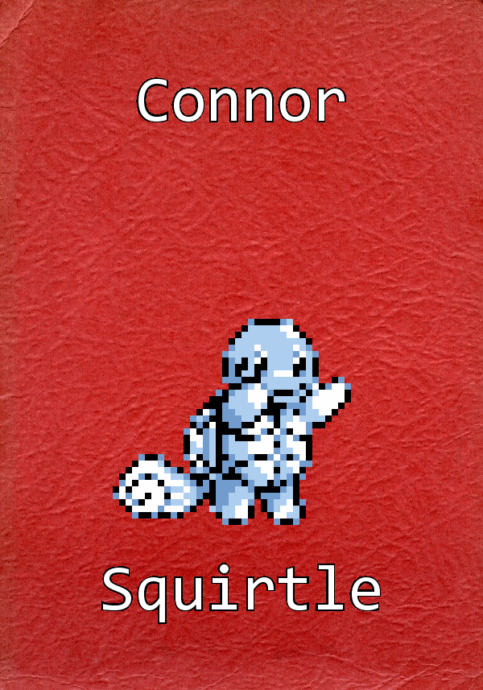

Pokemon-Decs
============

I needed a way to automate creating door decorations for my Resident Assistant job. This program takes a list of names, assigns a random pokemon to each name, and saves an image for each pokemon-name assignment. I have to make new decs about every two months, and I will use this program to automate the next three sets of decorations: I only assign pokemon that can evolve twice, and for each successive set of decorations I can simply evolve each pokemon and use a new background.

The end result will include a simple GUI so anyone can use this tool.
